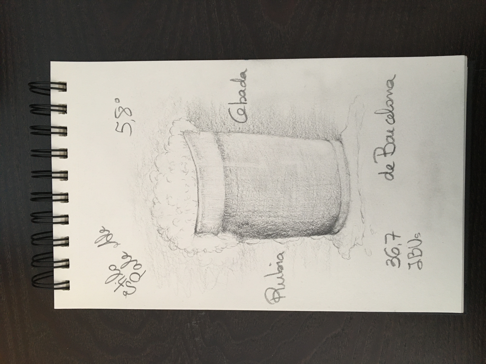

# Retrato robot de la cerveza artesana que se produce en España

Se incluye en este repositorio los ficheros de trabajo utilizados en la limpieza y análisis de información de alrededor de 400 cervezas artesanas de origen nacional.

El proyecto sigue la siguiente estructura de ficheros y fases:
1. *Limpiar_cervezas_artesanas.jpynb*: Código Python para la adecuación y limpieza de la información procedente de la web de origen de los datos
2. *Analisis_EDA_cervezas.ipynb*: Código Python con el análisis realizado basado en tablas y gráficas.
3. *Analisis_cervezas_artesanas_nacionales.pdf*: Informe con la información relevante obtenida en el análisis de las cervezas artesanas.
4. *Carpeta data*: Fichero original y tablas de trabajo generadas
5. *Carpeta graficas*: Graficas generadas y utilizadas en el informe

Retrato robot de la cerveza artesana obtenido tras el estudio

